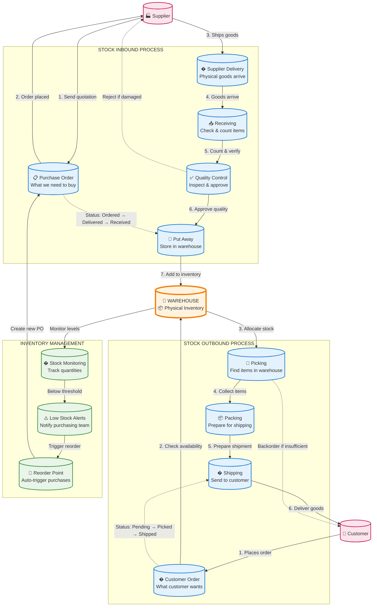

# Warehouse Stock Flow Diagram

This Mermaid diagram illustrates how inventory/stocks flow through the warehouse system via the different controllers and services.

## Real-World Warehouse Operations:

### INBOUND PROCESS (Stock Coming In):
1. **Purchase Order** → Purchasing team identifies what to buy based on demand/low stock
2. **Supplier Delivery** → Physical goods arrive at warehouse dock
3. **Receiving** → Staff count and verify items against purchase order
4. **Quality Control** → Inspect goods for damage, expiry dates, specifications
5. **Put Away** → Store approved items in designated warehouse locations
6. **Inventory Update** → System reflects new stock quantities

### OUTBOUND PROCESS (Stock Going Out):
1. **Customer Order** → Order received through sales channels
2. **Stock Check** → Verify availability and allocate inventory
3. **Picking** → Warehouse staff collect items from storage locations
4. **Packing** → Items packed securely for shipping
5. **Shipping** → Goods dispatched to customer
6. **Inventory Update** → System deducts shipped quantities

### INVENTORY MANAGEMENT:
- **Stock Monitoring** → Real-time tracking of inventory levels
- **Reorder Points** → Automatic triggers when stock falls below minimum levels
- **Low Stock Alerts** → Notifications to purchasing team for replenishment
- **Quality Control** → Reject damaged/expired goods back to supplier

### DECISION POINTS:
- **Receiving** → Accept or reject deliveries based on quality/quantity
- **Picking** → Handle backorders when insufficient stock available
- **Reordering** → Automatic purchase triggers maintain optimal stock levels
