# Warehouse Stock Flow Diagram

This Mermaid diagram illustrates how inventory/stocks flow through the warehouse system via the different controllers and services.

```mermaid
graph TD
    %% External Entities
    Supplier[("🏭 Supplier")]
    Customer[("👤 Customer")]
    
    %% Core Warehouse
    WH[("🏢 WAREHOUSE<br/>📦 Physical Inventory")]
    
    %% INWARD FLOW (Stock Coming In)
    subgraph "STOCK INBOUND PROCESS"
        direction TB
        PO[("📋 Purchase Order<br/>What we need to buy")]
        Delivery[("� Supplier Delivery<br/>Physical goods arrive")]
        Receive[("📥 Receiving<br/>Check & count items")]
        QC[("✅ Quality Control<br/>Inspect & approve")]
        PutAway[("📍 Put Away<br/>Store in warehouse")]
    end
    
    %% OUTWARD FLOW (Stock Going Out)
    subgraph "STOCK OUTBOUND PROCESS"
        direction TB
        Order[("� Customer Order<br/>What customer wants")]
        Pick[("🎯 Picking<br/>Find items in warehouse")]
        Pack[("📦 Packing<br/>Prepare for shipping")]
        Ship[("� Shipping<br/>Send to customer")]
    end
    
    %% Inventory Management
    subgraph "INVENTORY MANAGEMENT"
        direction LR
        Monitor[("� Stock Monitoring<br/>Track quantities")]
        Reorder[("🔄 Reorder Point<br/>Auto-trigger purchases")]
        Alerts[("⚠️ Low Stock Alerts<br/>Notify purchasing team")]
    end
    
    %% Process Flow - Inbound
    Supplier --> |"1. Send quotation"| PO
    PO --> |"2. Order placed"| Supplier
    Supplier --> |"3. Ships goods"| Delivery
    Delivery --> |"4. Goods arrive"| Receive
    Receive --> |"5. Count & verify"| QC
    QC --> |"6. Approve quality"| PutAway
    PutAway --> |"7. Add to inventory"| WH
    
    %% Process Flow - Outbound
    Customer --> |"1. Places order"| Order
    Order --> |"2. Check availability"| WH
    WH --> |"3. Allocate stock"| Pick
    Pick --> |"4. Collect items"| Pack
    Pack --> |"5. Prepare shipment"| Ship
    Ship --> |"6. Deliver goods"| Customer
    
    %% Inventory Management Flow
    WH --> |"Monitor levels"| Monitor
    Monitor --> |"Below threshold"| Alerts
    Alerts --> |"Trigger reorder"| Reorder
    Reorder --> |"Create new PO"| PO
    
    %% Real-world Scenarios
    PO -.-> |"Status: Ordered → Delivered → Received"| PutAway
    Order -.-> |"Status: Pending → Picked → Shipped"| Ship
    
    %% Critical Decision Points
    QC -.-> |"Reject if damaged"| Supplier
    Pick -.-> |"Backorder if insufficient"| Customer
    
    %% Styling
    classDef process fill:#e3f2fd,stroke:#1976d2,stroke-width:2px
    classDef warehouse fill:#fff3e0,stroke:#f57c00,stroke-width:4px
    classDef external fill:#fce4ec,stroke:#c2185b,stroke-width:2px
    classDef management fill:#e8f5e8,stroke:#388e3c,stroke-width:2px
    
    class PO,Delivery,Receive,QC,PutAway,Order,Pick,Pack,Ship process
    class WH warehouse
    class Supplier,Customer external
    class Monitor,Reorder,Alerts management
```

## Real-World Warehouse Operations:

### INBOUND PROCESS (Stock Coming In):
1. **Purchase Order** → Purchasing team identifies what to buy based on demand/low stock
2. **Supplier Delivery** → Physical goods arrive at warehouse dock
3. **Receiving** → Staff count and verify items against purchase order
4. **Quality Control** → Inspect goods for damage, expiry dates, specifications
5. **Put Away** → Store approved items in designated warehouse locations
6. **Inventory Update** → System reflects new stock quantities

### OUTBOUND PROCESS (Stock Going Out):
1. **Customer Order** → Order received through sales channels
2. **Stock Check** → Verify availability and allocate inventory
3. **Picking** → Warehouse staff collect items from storage locations
4. **Packing** → Items packed securely for shipping
5. **Shipping** → Goods dispatched to customer
6. **Inventory Update** → System deducts shipped quantities

### INVENTORY MANAGEMENT:
- **Stock Monitoring** → Real-time tracking of inventory levels
- **Reorder Points** → Automatic triggers when stock falls below minimum levels
- **Low Stock Alerts** → Notifications to purchasing team for replenishment
- **Quality Control** → Reject damaged/expired goods back to supplier

### DECISION POINTS:
- **Receiving** → Accept or reject deliveries based on quality/quantity
- **Picking** → Handle backorders when insufficient stock available
- **Reordering** → Automatic purchase triggers maintain optimal stock levels
